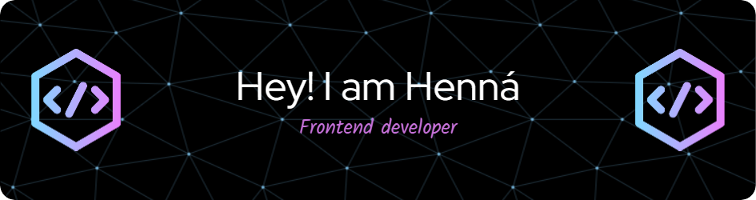

## Hi I'm Henna 
I'm Henna Maria a Frontend Developer. I Spend most of my time coding outstanding projects.

:mailbox: Reach me out!

### What I Currently Do

- 🔭 I’m currently pursuring MERN Stack
- :computer: Most used line of code `git commit -m "Initial Commit"`
- 📫 How to reach me: hennamaria2001@gmail.com.
- 💬 Ask me about Frontend, Git.
- ⚡ Fun fact: I hold a Bachelor's degree in Computer Science Engineering, a testament to my dedication and academic prowess.

### Languages and Tools

  
  
  
  
</a> 
 

 #### Bizness
- :paperclip:  <a href="https://github.com/Hennamaria07/Hennamaria07/blob/master/resume/resume.png" style="text-decoration: none;color:#00b9b9">My Resume/CV</a>
- :email: <a href="#" style="text-decoration: none;color:#00b9b9">hennamaria2001@gmail.com</a>

### Coding Stats

### Github Stats

