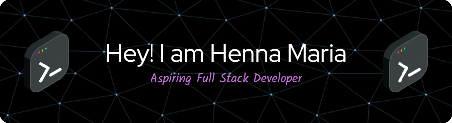

## About Me
Results-oriented MERN stack developer skilled in developing robust web applications using React, Node.js, Express.js, and MongoDB. Proven ability to create efficient, user-friendly solutions that optimize performance and usability. Detail-oriented with a passion for staying up to date with the latest technologies and best practices in web development. Collaborative team player dedicated to delivering high-quality results and contributing to the success of innovative projects.
:mailbox: Reach me out!

### What I Currently Do

- 🔭 I’m currently pursuring MERN Stack
- :computer: Most used line of code `git commit -m "Initial Commit"`
- 📫 How to reach me: hennamaria2001@gmail.com.
- 💬 Ask me about Frontend, Git.
- ⚡ Fun fact: I hold a Bachelor's degree in Computer Science Engineering, a testament to my dedication and academic prowess.

#### 💻 Here's what I bring to the coding table :

- Proficient in HTML, CSS, and JavaScript (JS) for crafting interactive and dynamic web applications.
- LaTeX enthusiast, turning complex documents into beautifully formatted masterpieces.
- Version control wizard with Git, ensuring seamless and error-free code collaboration.
- Styling extraordinaire with Bootstrap, because aesthetics matter.
- On a mission to make the web more user-friendly, one line of code at a time.
### Languages and Tools

 

 #### Bizness
- :paperclip:  <a href="https://github.com/Hennamaria07/Hennamaria07/blob/master/resume/resume.png" style="text-decoration: none;color:#00b9b9">My Resume/CV</a>
- :email: <a href="#" style="text-decoration: none;color:#00b9b9">hennamaria2001@gmail.com</a>

### Coding Stats

### Github Stats

